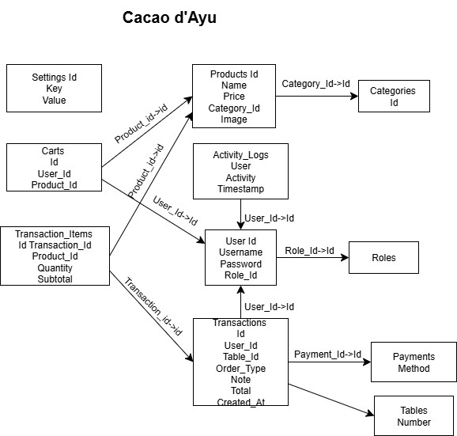

#                                 🍵 Cacao d’Ayu - Coffee Shop Web App

Cacao d’Ayu adalah sebuah aplikasi web dinamis berbasis PHP Native dan MySQL yang dirancang untuk memudahkan pengelolaan sebuah cafe . Aplikasi ini menyediakan antarmuka untuk admin dan pengguna dengan fitur lengkap seperti manajemen produk, transaksi, laporan, checkout, serta dukungan ekspor data dan cetak struk.

## ✨ Fitur Utama
### Untuk Admin
1. Login Admin
2. Dashboard Statistik (Jumlah User, Produk, Transaksi Harian)
3. Manajemen Produk (CRUD + Upload Gambar)
4. Manajemen Kategori Produk
5. Manajemen Pengguna & Role (Admin/User)
6. Laporan Transaksi + Cetak Struk HTML
### Untuk Pengguna
1. Login & Registrasi User
2. Tampilan Menu Produk berdasarkan Kategori
3. Fitur Keranjang Belanja
4. Checkout dengan Jenis Pesanan (Dine-in, Takeaway, Delivery)
5. Pilih Metode Pembayaran (Cash, QRIS, Transfer)

## 🎨 Tampilan UI
1. Menggunakan Bootstrap 5.3 untuk tampilan yang responsif, modern, dan nyaman digunakan di berbagai perangkat.

## 🔗 Teknologi
1. PHP Native 8.2
2. MySQL (phpMyAdmin)
3. Bootstrap 5.3

## 📄 Struktur Folder
projek/
├── docs/               # README.md & INSTALL.md
├── sql/                # cafe_app.sql
├── src/                # Kode sumber
│   ├── uploads/        # Gambar produk
│   ├── assets/         # Gambar QRIS
│   └── [semua file PHP utama] seperti login.php, dashboard.php, dll.

## 🗂️ Diagram ERD

Diagram ini menunjukkan relasi antar tabel dalam database Cacao d’Ayu.

## 📹 Video Demo
Tonton demo penggunaan dan penjelasan proyek:
👉 [Klik untuk menonton di YouTube](https://youtu.be/sznGOmBTK8M?si=GbPN8_vovJHUQoEW)

## 🌐 Link Hosting (Live Demo)
Kunjungi versi live dari aplikasi Cacao d’Ayu:
👉 [https://cacaodayu.my.id/login.php](https://cacaodayu.my.id/login.php)

### 🔑 Akun Default untuk Uji Coba

**Admin:**
- Username: `admin`
- Password: `admin`

**Pengguna (User):**
- Username: `Ayuwlnn`
- Password: `aaaaa`

## Dibuat oleh
- **Nama**: Ayu Wulanadari
- **NIM**: 202312065
- **Mata Kuliah**: Pemrograman Web – UAS
- **Kampus**: Sekolah Tinggi Teknologi Bontang
- **Tahun**: 2025
